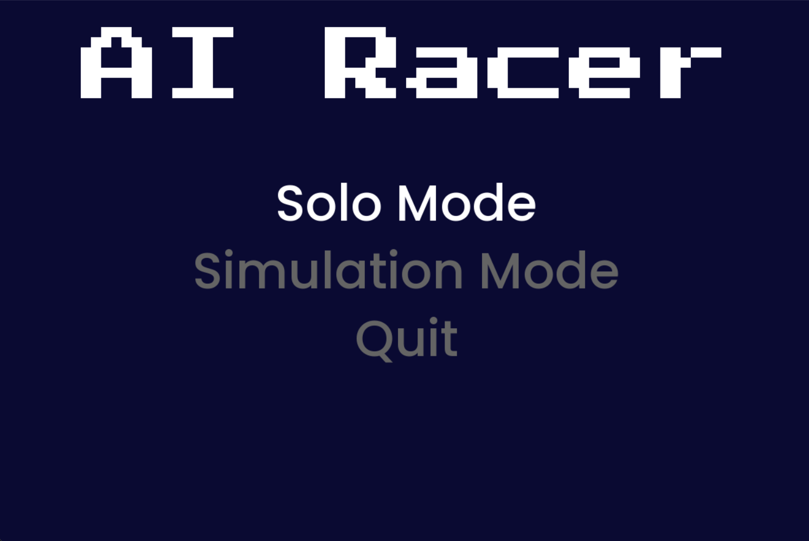
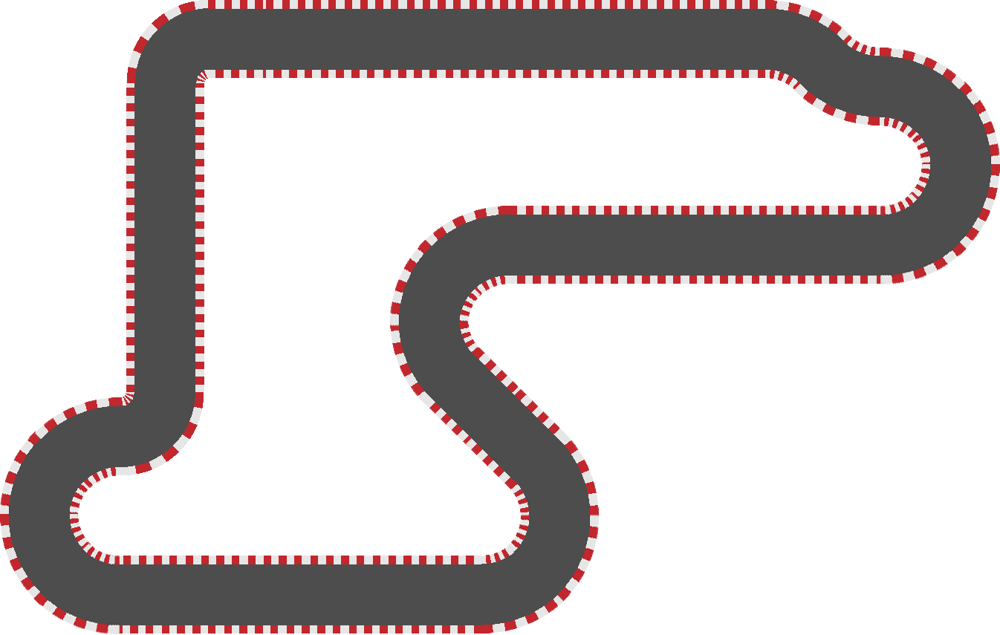
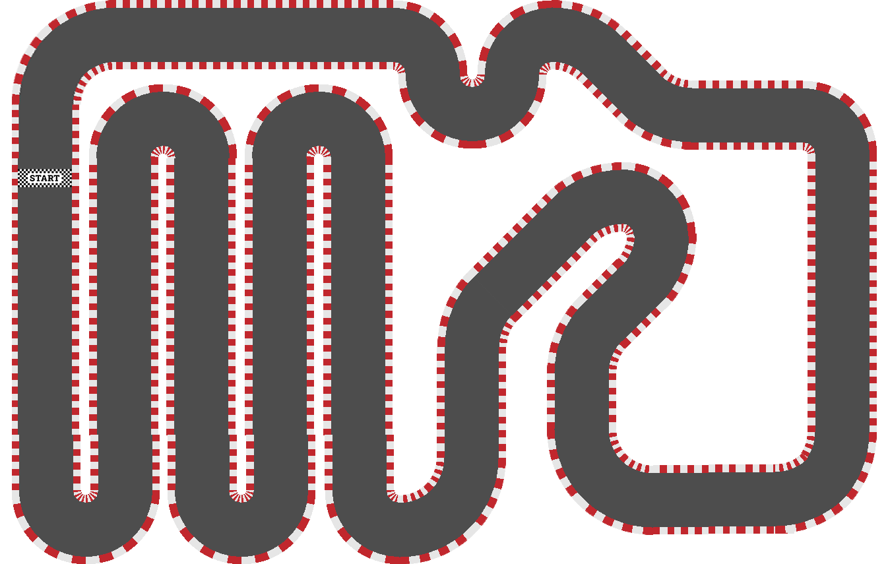
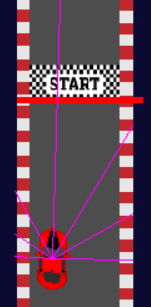
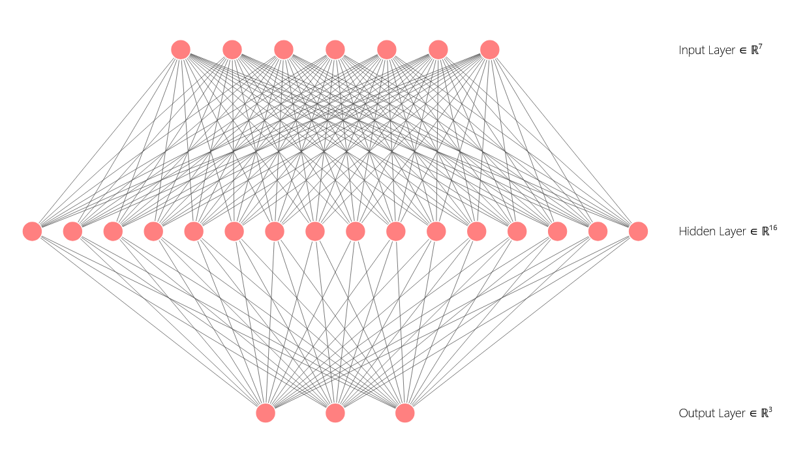

# AI Racing Car

Welcome to the AI Racing Car project! This project involves the development of an AI-powered racing car that can autonomously navigate a track. The AI is designed to train itself through multiple generations, with the best-performing agent from each generation advancing to the next round of training.

## Overview

The AI Racing Car project utilizes a genetic algorithm to improve the performance of the racing car. The algorithm involves the following steps:

1. **Initialization**: A population of agents is initialized with random parameters.
2. **Simulation**: Each agent controls a car on a track, and its performance is evaluated based on its ability to complete the track efficiently.
3. **Selection**: The best-performing agent from each generation is selected to survive into the next generation.
4. **Crossover and Mutation**: New agents are created by combining and mutating the parameters of the best agents to introduce variability.
5. **Iteration**: Steps 2-4 are repeated over many generations, allowing the AI to progressively improve its racing capabilities.

### Menu


The menu allow the user to choose between several game mode:

1. **Solo**: The user can move freely on the track (no collisions)
2. **Simulation**: The user can choose to make the AI to race on both maps (and select between both agents, including a blank untrained agent)

### Maps




### How does it work ?

Each car (or agent) cast rays in various directions. The lengths of these rays are the inputs of the neural network.


The neral network consist of 7 neurons on the input layer (depending on the number of rays), 16 neuron in the hidden layer, and 3 neurons on the output layer (steer left, right & brake, the cars always accelerate). The network uses RelU activation function.


## Getting Started

To get started with the AI Racing Car project, follow these steps:

1. **Installation**: Ensure you have Python and Pygame installed on your system. You can install Pygame using the following command:
   ```
   pip install pygame numpy
   ```

2. **Cloning the Repository**: Clone this repository to your local machine using:
   ```
   git clone https://github.com/yourusername/Projet_AI.git
   ```

3. **Running the Simulation**: Navigate to the project directory and run the main simulation script:
   ```
   cd Projet_AI
   python src/test_simu.py
   ```

4. **Observing the Training Process**: Watch as the AI trains over multiple generations, with each generation producing a more refined racing agent.

## Contributing

Contributions to the AI Racing Car project are welcome! If you have ideas for improvements or would like to add features, please feel free to fork the repository and submit a pull request.

## Team
This is a team project:

* **[Alfred de Vulpian](https://github.com/Alfred0404)**
* **[Clément d'Alberto](https://github.com/Clement-dl)**
* **[Ethan Pétain](https://github.com/SirTeenager)**

## License

This project is licensed under the MIT License - see the [LICENSE](LICENSE) file for details.

## Acknowledgments

- The development and optimization of the AI Racing Car are inspired by various machine learning and genetic algorithm research.
- Special thanks to the open-source community for providing valuable tools and resources.